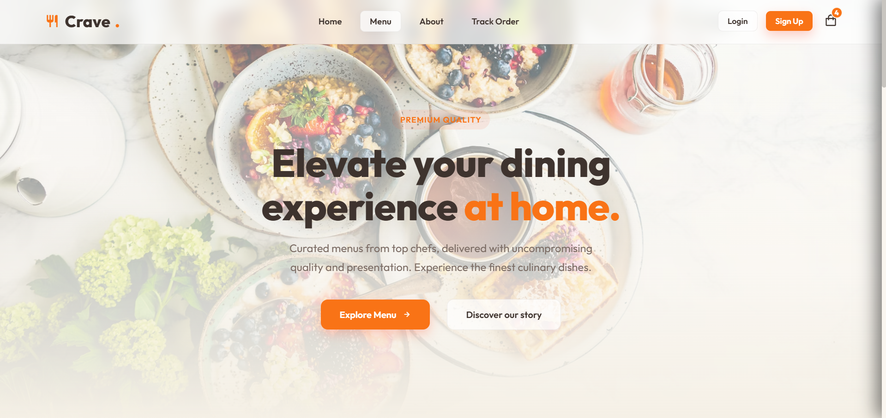
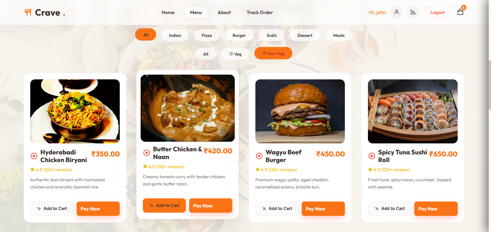
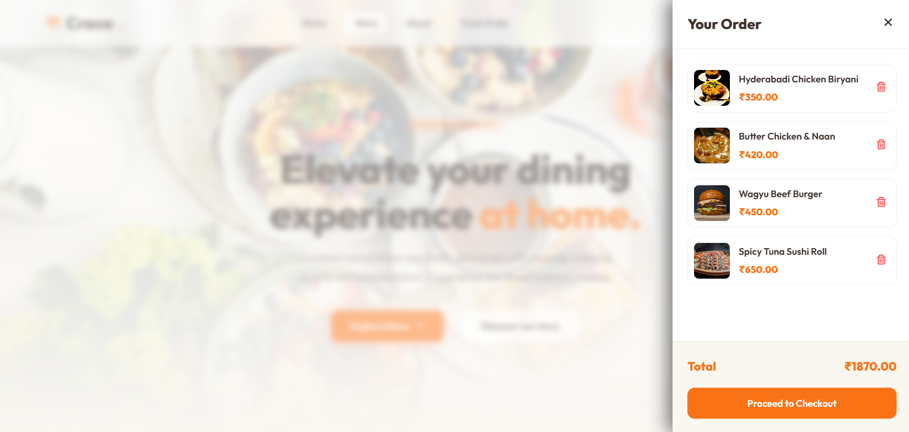
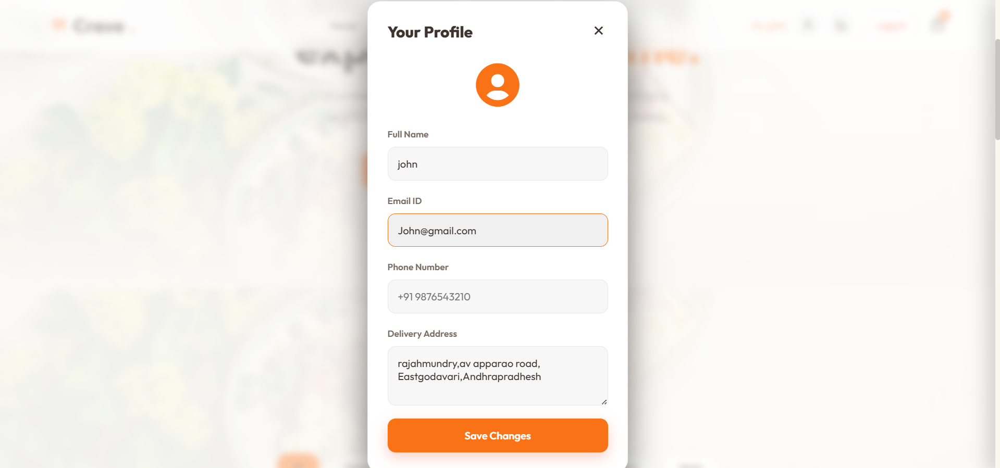
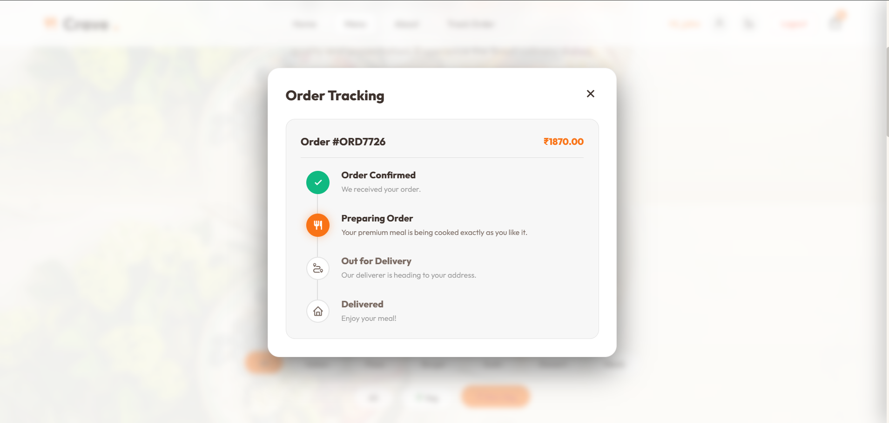

# 📄 Food Delivery Menu Interface (FSD Lab Project)

🌐 **Live Demo:** https://naga-lakshmi10.github.io/food-delivery-menu-interface-FSD/
🔗 Click the link above to explore the live application.

---

## 📌 1. Project Title

**Food Delivery Menu Interface**

---

## 📌 2. Objective

The objective of this project is to design and develop a **responsive food delivery web application interface** that allows users to browse food items, add them to a cart, and simulate ordering functionality using frontend technologies.

---

## 📌 3. Project Description

This project is a **frontend-based web application** that simulates a real-world food delivery system. It provides an interactive and user-friendly interface where users can explore food items, manage their cart, and track orders.

The application uses **HTML, CSS, and JavaScript**, and stores user and cart data using **LocalStorage**, eliminating the need for backend integration.

---

## 📌 4. Technologies Used

* **HTML5** – Structure of web pages
* **CSS3** – Styling and responsive design
* **JavaScript (Vanilla JS)** – Application logic and interactivity
* **LocalStorage** – Client-side data storage

---

## 📌 5. System Requirements

### 🔹 Hardware Requirements

* Computer / Laptop
* Minimum 4GB RAM

### 🔹 Software Requirements

* Web Browser (Chrome, Edge, etc.)
* Code Editor (VS Code recommended)

---

## 📌 6. Modules / Features

### 🔹 1. Home Page

* Displays landing interface
* Provides navigation to menu

### 🔹 2. Menu Module

* Displays food items
* Veg / Non-Veg filtering
* Add to cart functionality

### 🔹 3. Cart Module

* Displays selected items
* Calculates total price
* Allows item removal

### 🔹 4. Authentication Module

* Login and Signup system
* Stores user data in LocalStorage

### 🔹 5. Order Tracking Module

* Simulates order status updates
  *(Processing → Out for Delivery → Delivered)*

---

## 📌 7. Algorithm / Working Logic

1. Display all food items on the menu page
2. When user clicks **Add to Cart**, store item details in LocalStorage
3. Update cart count and total price dynamically
4. Allow users to remove items from cart
5. Store login/signup details in LocalStorage
6. On placing order, simulate order tracking stages
7. Display order status to the user

---

## 📌 8. Use Case

User opens the application → browses food menu → adds items to cart → logs in → places order → tracks order status.

---

## 📌 9. Screenshots

### 🏠 Home Page



### 🍕 Menu Section



### 🛒 Cart System



### 🔐 Login / Signup



### 📦 Order Tracking



---

## 📌 10. Project Structure

```plaintext
food-delivery-menu-interface-FSD/
│
├── index.html
├── styles.css
├── script.js
├── README.md
├── DOCUMENTATION.md
├── Food_Delivery_Documentation.pdf
├── images/
├── screenshots/
```

---

## 📌 11. Advantages

* User-friendly interface
* No backend required
* Lightweight and fast
* Easy to understand and implement
* Suitable for beginners

---

## 📌 12. Limitations

* No real database integration
* No payment gateway
* Data stored only in browser (LocalStorage)
* Not scalable for real-world applications

---

## 📌 13. Future Enhancements

* Backend integration (Node.js / Firebase)
* Payment gateway integration
* Real-time order tracking
* Admin dashboard for management

---

## 📌 14. Conclusion

The **Food Delivery Menu Interface** project successfully demonstrates the development of a responsive and interactive web application using frontend technologies. It provides a strong foundation for understanding real-world food delivery systems and can be extended into a complete full-stack application.

---

## 📌 15. References

* https://developer.mozilla.org/ (MDN Web Docs)
* https://www.w3schools.com/
* HTML, CSS, JavaScript official documentation

---

## 📌 16. Team Members

* **Nagalakshmi** – Frontend UI Design & Documentation
* **Riyaz Mohammed** – JavaScript Logic
* **Snigdha Nistala** – Authentication
* **Divya Rednam** – Testing

---
